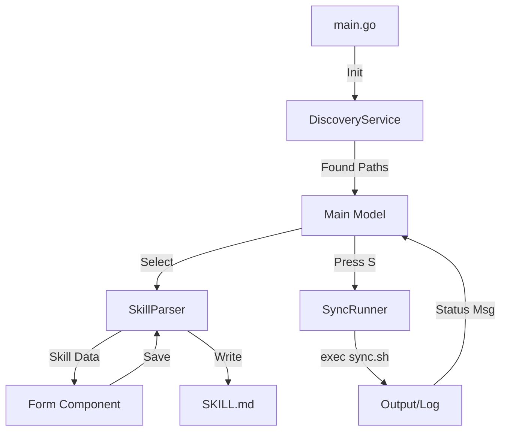

# Design: TUI Go Skills Management (sdd/tui-go-skills/design)

## Technical Approach

Go 1.21 binary. Bubble Tea MVU pattern. `yaml.v3` Node API for comment preservation. Atomic writes for safety.

## Architecture Decisions

| Decision | Choice | Rationale |
|----------|--------|-----------|
| YAML Library | `gopkg.in/yaml.v3` | Node API preserves comments/order. |
| TUI Framework | `Bubble Tea` | Standard MVU for Go terminal apps. |
| IO Strategy | Atomic Write | Write temp -> Rename to avoid corruption. |
| Styling | `Lip Gloss` | Declarative UI styling for TUI. |

## Data Flow



## File structure

```
/TUI
├── main.go                 # Entry point, setup bubbletea program
├── go.mod                  # Deps: bubbletea, lipgloss, yaml.v3
└── internal
    ├── discovery
    │   └── service.go      # Scan dirs for SKILL.md files
    ├── parser
    │   └── parser.go       # Read/Write YAML frontmatter (Node API)
    ├── runner
    │   └── sync.go         # Execute ./.agent/skills/skill-sync/assets/sync.sh
    ├── ui
    │   ├── model.go        # Root Model (MVU)
    │   ├── list.go         # Skill selection sub-component
    │   ├── form.go         # Metadata editor sub-component
    │   └── style.go        # Lip Gloss definitions
    └── types
        └── skill.go        # Skill/Metadata struct definitions
```

## Interfaces / Contracts

```go
// internal/types/skill.go
type Skill struct {
    Path     string
    Metadata Metadata
    RawYAML  string // Raw frontmatter for round-tripping
    Body     string // Markdown content (read-only)
}

type Metadata struct {
    Name        string   `yaml:"name"`
    Description string   `yaml:"description"`
    Scope       []string `yaml:"scope"`
    AutoInvoke  []string `yaml:"auto_invoke"`
    LocalOnly   bool     `yaml:"local_only"`
}

// internal/parser/parser.go
type SkillParser interface {
    Parse(path string) (*Skill, error)
    Save(skill *Skill) error
}
```

## Testing Strategy

| Layer | What to Test | Approach |
|-------|-------------|----------|
| Unit | Parser | Round-trip YAML with comments. Ensure 1:1 parity. |
| Unit | Discovery | Mock FS with folders. Verify SKILL.md detection. |
| Unit | Runner | Mock exec. Verify output capture & exit codes. |
| TUI | UI | `teatest` to simulate key presses (Arrows, Enter, S). |

## Testing Phase: Validation vs Specs

- [x] **DiscoveryService**: Scans subtree for `SKILL.md`. Maps to Spec "Skill Discovery".
- [x] **SkillParser (yaml.v3)**: Preserves comments using Node API. Maps to Spec "Preserve Formatting".
- [x] **SyncRunner**: Executes `sync.sh` + captures output. Maps to Spec "Sync Action".
- [x] **Form Component**: Edits all required fields + `local_only`. Maps to Spec "Field Editing".
- [x] **Atomic Write**: `Parser.Save` uses temp files. Maps to Spec "Risks: Data corruption".

## Open Questions

- Should TUI search recursively from `.` or only in predefined `.agent/skills`? (Design assumes recursive search).
- What happens if `sync.sh` takes > 10s? (Design assumes async execution with status updates).
