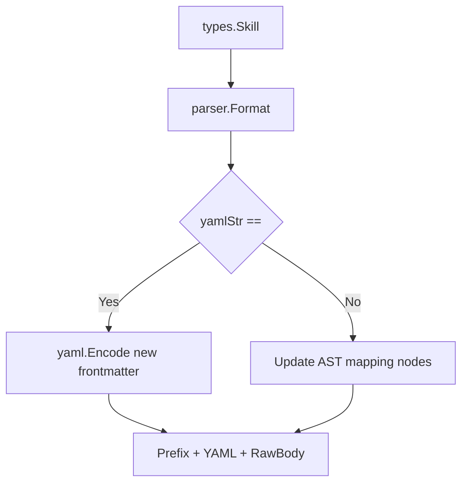

# Technical Design: Fix Cursor and Metadata

## Technical Approach

### 1. Fix TUI Installer Cursor Highlight
In `internal/ui/installer_model.go`, the `OptionsView` function renders the option list and applies a cursor marker `> ` to the active item.
The cursor indexing is as follows:
- `0..4`: Providers
- `5..7`: Skills
- `8`: Autoskills / Smart Scan
- `9..(9+storageOffset-1)`: Stored Skills
- `9+storageOffset`: Add shell aliases (Global)
- `10+storageOffset`: Execute Install

However, in `OptionsView`, both "Add shell aliases" and "Execute Install" cursor check conditions were written as checking `m.Cursor == 9+storageOffset`. This caused the cursor to display on both or fail to highlight "[ Execute Install ]" correctly when `m.Cursor` was at `10+storageOffset`. We will fix this by changing the cursor check condition for `cursorAction` to `m.Cursor == 10+storageOffset`.

### 2. Fix parser.go Format Metadata Loss
In `internal/parser/parser.go`, the `Format` function converts a `types.Skill` object back into its markdown file content containing YAML frontmatter and the raw body.
When formatting a skill that does not have an existing file path or existing frontmatter (`yamlStr == ""`), the function manually formats a minimal YAML frontmatter string. This manually constructed string only serializes `scope` and `auto_invoke`, completely dropping `name`, `description`, and `local_only`.

We will rewrite this branch to use a standard struct and `yaml.NewEncoder` to serialize all metadata fields (`name`, `description`, `scope`, `local_only`, and `auto_invoke`) into YAML frontmatter. This ensures metadata is preserved correctly when creating a skill from scratch.

## Architecture Decisions
- Use `yaml.NewEncoder` to guarantee correct YAML serialization (escaping, encoding) for new frontmatter, instead of manual string builder concatenation.
- Avoid introducing any state changes to models outside internal fixes.

## Data Flow


## File Changes

### `internal/ui/installer_model.go`
- Update the condition for `cursorAction` in `OptionsView` at line 266:
```diff
-	cursorAction := "  "
-	if m.Cursor == 9+storageOffset {
-		cursorAction = "> "
-	}
+	cursorAction := "  "
+	if m.Cursor == 10+storageOffset {
+		cursorAction = "> "
+	}
```

### `internal/parser/parser.go`
- Update the `yamlStr == ""` branch in `Format`:
```go
	if yamlStr == "" {
		var localOnlyPtr *bool
		if skill.Metadata.LocalOnly {
			val := true
			localOnlyPtr = &val
		}
		var autoInvoke []string
		if len(skill.Metadata.AutoInvoke) > 0 {
			autoInvoke = skill.Metadata.AutoInvoke
		}
		frontmatter := struct {
			Name        string   `yaml:"name,omitempty"`
			Description string   `yaml:"description,omitempty"`
			Scope       string   `yaml:"scope,omitempty"`
			LocalOnly   *bool    `yaml:"local_only,omitempty"`
			AutoInvoke  []string `yaml:"auto_invoke,omitempty"`
		}{
			Name:        skill.Name,
			Description: skill.Metadata.Description,
			Scope:       skill.Metadata.Scope,
			LocalOnly:   localOnlyPtr,
			AutoInvoke:  autoInvoke,
		}

		var buf bytes.Buffer
		enc := yaml.NewEncoder(&buf)
		enc.SetIndent(2)
		if err := enc.Encode(&frontmatter); err != nil {
			return "", err
		}

		yamlResult := buf.String()
		if !strings.HasPrefix(yamlResult, "---") {
			yamlResult = "---\n" + yamlResult
		}
		if !strings.HasSuffix(yamlResult, "---\n") {
			if strings.HasSuffix(yamlResult, "---") {
				yamlResult = yamlResult + "\n"
			} else {
				yamlResult = yamlResult + "---\n"
			}
		}
		return skill.Prefix + yamlResult + skill.RawBody, nil
	}
```

## Interfaces / Contracts
No changes to public functions or structures. Both `Format(skill *types.Skill)` and the TUI rendering flow contracts are preserved.

## Testing Strategy
- **Manual verification** of the cursor behavior using the TUI sandbox.
- **Unit test** in `internal/parser/parser_test.go` to test frontmatter serialization from scratch:
  Verify that when `skill.Path` is empty, all attributes (`name`, `description`, `scope`, `local_only`, and `auto_invoke`) are correctly serialized.

## Migration / Rollout
No database or storage migration is required.

## Open Questions
None.
